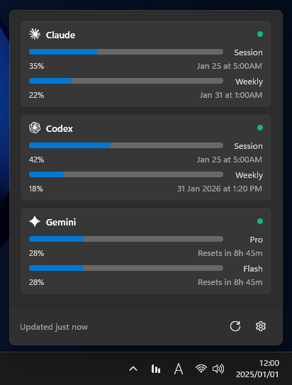

# CodexBarWin

Windows native UI for AI coding tool usage monitoring.

[](https://github.com/nek0der/CodexBarWin/actions/workflows/build.yml)
[](https://github.com/nek0der/CodexBarWin/actions/workflows/test.yml)
[](https://opensource.org/licenses/MIT)
[](https://dotnet.microsoft.com/)
[](https://microsoft.github.io/microsoft-ui-xaml/)

## Overview

A Windows 11 native app that displays usage limits for AI coding tools (Claude, Codex, Gemini) in the system tray.

This is a WinUI 3 frontend wrapper for [CodexBar CLI](https://github.com/steipete/CodexBar).

## Screenshots



*Multi-provider usage monitoring with real-time updates*

## Features

- Native Windows 11 UI (WinUI 3 + Mica)
- Multi-provider support
- System tray integration
- Dark mode support
- Auto refresh

## Supported Providers

- Claude
- Codex (OpenAI)
- Gemini

## Requirements

- Windows 10 (1809+) / Windows 11
- WSL 2 with a Linux distribution (Ubuntu recommended)
- .NET 10.0 Runtime
- [CodexBar CLI](https://github.com/steipete/CodexBar)

## Installation

### Option 1: MSIX Package (Recommended)

MSIX packages provide automatic updates and a clean installation experience.

#### Step 1: Install the Certificate

1. Download `CodexBarWin-vX.X.X-Certificate.cer` from [Releases](https://github.com/nek0der/CodexBarWin/releases)
2. Right-click the `.cer` file and select **Install Certificate**
3. Select **Local Machine** (requires Administrator)
4. Choose **Place all certificates in the following store**
5. Click **Browse** and select **Trusted People**
6. Click **OK** and **Finish**

#### Step 2: Install the App

**Option A: Using .appinstaller (Auto-update enabled)**

1. Download `CodexBarWin.appinstaller` from [Releases](https://github.com/nek0der/CodexBarWin/releases)
2. Double-click the `.appinstaller` file
3. Click **Install** in the App Installer dialog
4. The app will automatically check for updates on launch

**Option B: Using .msix (Manual install)**

1. Download `CodexBarWin-vX.X.X-x64.msix` from [Releases](https://github.com/nek0der/CodexBarWin/releases)
2. Double-click the `.msix` file
3. Click **Install** in the App Installer dialog

#### Uninstall

1. Open **Settings** > **Apps** > **Installed apps**
2. Find **CodexBarWin** and click **Uninstall**

### Option 2: Build from Source

```bash
git clone https://github.com/nek0der/CodexBarWin.git
cd CodexBarWin
dotnet build -c Release -p:Platform=x64
```

## Usage

1. Launch CodexBarWin
2. App minimizes to system tray
3. Click tray icon to view usage

## Troubleshooting

### MSIX Installation Issues

#### "The app package must be signed" error

You need to install the certificate first (see Installation Step 1 above).

#### "This app package is not signed with a trusted certificate" error

The certificate was not installed to **Trusted People**. Uninstall the certificate and reinstall it to the correct store.

#### Unable to install: "The package could not be installed"

1. Ensure you're running Windows 10 (1809+) or Windows 11
2. Check if there's an existing installation and uninstall it first
3. Run PowerShell as Administrator and execute:
   ```powershell
   Get-AppxPackage *CodexBarWin* | Remove-AppxPackage
   ```

### "WSL is not installed" error

1. Open PowerShell as Administrator
2. Run: `wsl --install`
3. Restart your computer
4. Run: `wsl --set-default-version 2`

### "CodexBar CLI not found" error

1. Install [CodexBar CLI](https://github.com/steipete/CodexBar)
2. Follow the installation instructions in the CLI repository
3. Verify installation: `wsl codexbar --version`

### App doesn't start or crashes

1. Ensure .NET 10.0 Runtime is installed
2. Check Windows version (requires 1809+)
3. Try running as Administrator
4. Check `%LOCALAPPDATA%\CodexBarWin\` for logs

### Data not refreshing

1. Check WSL is running: `wsl --status`
2. Verify CodexBar CLI works: `wsl codexbar --provider claude --format json`
3. Check Settings page for refresh interval configuration

### Configuration

Settings are stored in `%LOCALAPPDATA%\CodexBarWin\settings.json`:

```json
{
  "version": 1,
  "refreshIntervalSeconds": 120,
  "startWithWindows": false,
  "startMinimized": true,
  "timeouts": {
    "wslCommandTimeoutSeconds": 30,
    "cliProviderFirstFetchTimeoutSeconds": 60,
    "cliProviderTimeoutSeconds": 45,
    "standardProviderFirstFetchTimeoutSeconds": 20,
    "standardProviderTimeoutSeconds": 10
  }
}
```

## Documentation

- [Contributing Guidelines](CONTRIBUTING.md)
- [Changelog](CHANGELOG.md)
- [Security Policy](SECURITY.md)
- [Code of Conduct](CODE_OF_CONDUCT.md)

## Contributing

Contributions are welcome! Please read our [Contributing Guidelines](CONTRIBUTING.md) before submitting a Pull Request.

## Related Projects

- [CodexBar](https://github.com/steipete/CodexBar) - Original macOS app

## License

This project is licensed under the MIT License - see the [LICENSE.txt](LICENSE.txt) file for details.

Third-party dependency licenses are automatically checked in CI. To generate a license report locally:

```bash
dotnet tool install --global nuget-license
nuget-license --input CodexBarWin.sln
```
